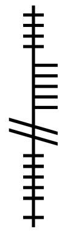

# Aspects

|Aspect|Name|Race|Class|Background|Mark|
|---|---|---|---|---|---|
|War (cogadh)|Morthos|Deep Gnome|Fighter|||
|Tempest (stoirm)|Sagweth|Deep Gnome|Barbarian|||
|Death (bás)|Gonthos|Deep Gnome|Rogue|||
|Life (saol)|Gnomos|Rock Gnome|Bard|||
|Light (solas)|Galweth|Rock Gnome|Sorcerer||||
|Thought (smaoineamh)|Curutha|Rock Gnome|Wizard|||
|Nature (nádúr)|Gwimlos|Rock Gnome|Ranger|||
|Trickery (feall)|Sanatha|Rock Gnome|Artificer|||
