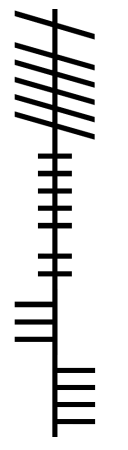

# Experiments in Knowledge

Bina put the last stone in place. A small hum could be felt up his arm as he slipped each of his fingers in each slot.

Saying the incantation and moving his hands in the prescribed pattern activated the stones and light burst forth.

A small silvery vertical slash appeared in the air in front of Bina. Like opening a sliding window he expanded the slash to a door sized for a gnome.

## Adventures in Tir Na Og

Taking two steps in Bina vanished and the portal winked shut.

When he opened his eyes bina saw a vast green plain. 

Dotted amongst the landscape were cairns and other standing stones

A small village and a large wooden palace lay along the horizon.

## Meeting with Oghma

Bina asks for access to the library of all knowledge.

Oghma pleasantly surprised by the tiny gnome’s guile and pluck decides to bestow a boon.  

The god Oghma teaches Bina his secret language Ogham. 

Bina of course wanted more. So Oghma sets a pact. 

He will grant Bina the power to accumulate all aspects of knowledge, but never hold it all at once.  

Bina starts to feel a warm glow.  He sees no more. 

# Aspects

|Aspect|Name|Race|Class|Background|Mark|
|---|---|---|---|---|---|
|War (cogadh)|Morthos|Deep Gnome|Fighter|||
|Tempest (stoirm)|Sagweth|Deep Gnome|Barbarian|||
|Death (bás)|Gonthos|Deep Gnome|Rogue|||
|Life (saol)|Gnomos|Rock Gnome|Bard|Gnomos wakes up. He craves bread and water. He’s got a strange birthmark.  He remembers tons of songs, but not any with him in it.||
|Light (solas)|Galweth|Rock Gnome|Sorcerer||||
|Thought (smaoineamh)|Curutha|Rock Gnome|Wizard|||
|Nature (nádúr)|Gwimlos|Rock Gnome|Ranger|||
|Trickery (feall)|Sanatha|Rock Gnome|Artificer|||
